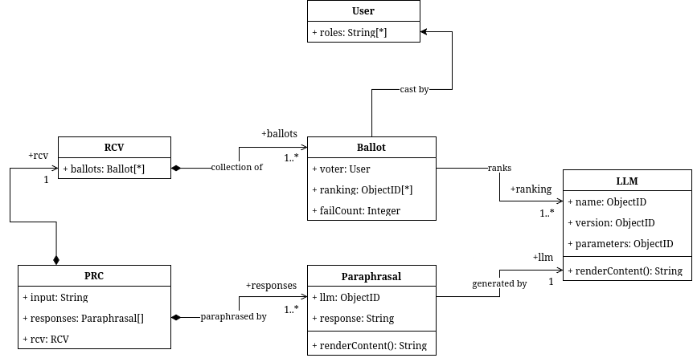

# 1. VHC Dashboard

A dashboard of utilities for the EHR-compliant record digitization component of the Ashoka Augmented Health Systems (AHS) project.

## 1.1. Technologies

- **Web Frameworks:** [ExpressJS](https://expressjs.com/)
- **Frontend:** [Pug](https://pugjs.org/)
- **Database:** [MongoDB](https://www.mongodb.com/), [Mongoose](https://mongoosejs.com/)

## 1.2. Applications

### 1.2.1. Model Output Ranker

An application to facilitate the ranking of LLM-generated transcribed prescription text paraphrasals. Paraphrasals are ranked numerically, and assigned a passing (default) or failing (if completely inadmissible for further processing) status. The application generates ballot data structures that may be processed by a ranked-choice voting algorithm to create insights.

#### Data Representation

