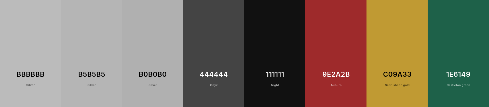
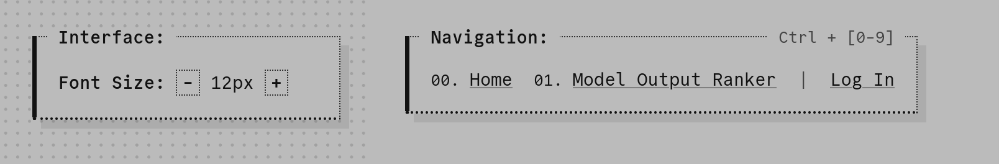
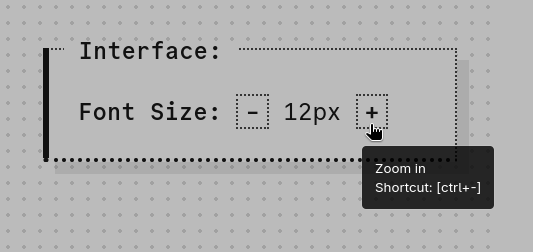
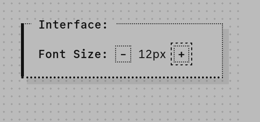
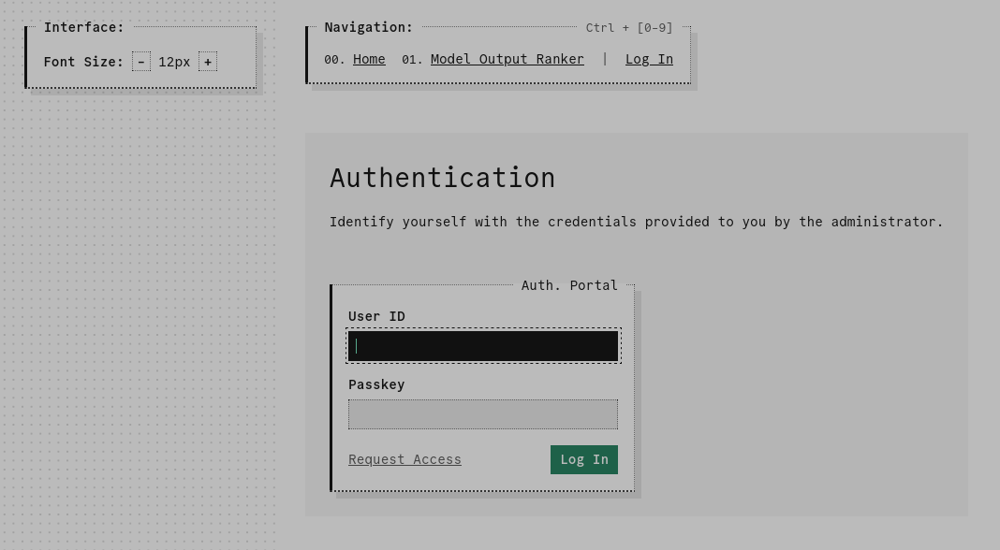
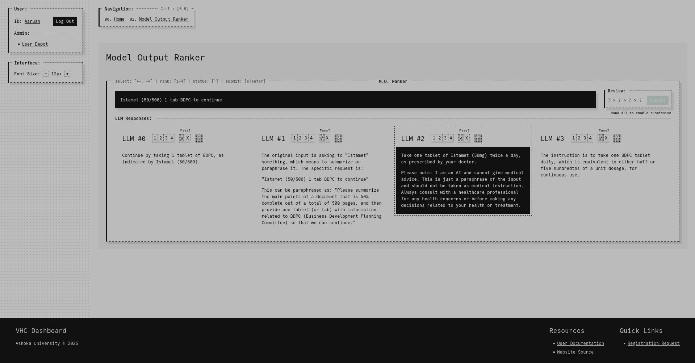
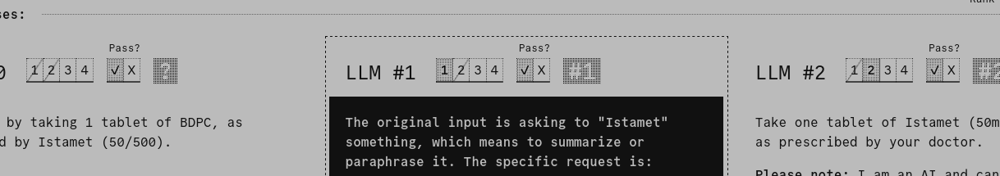
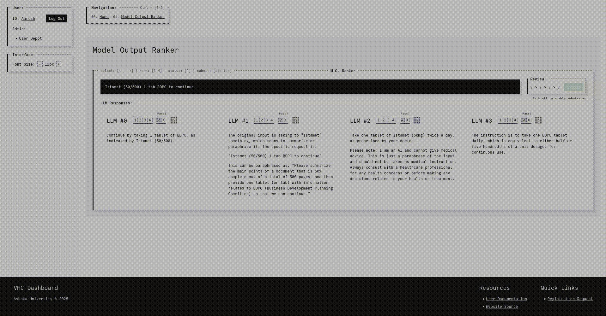

# 1. Global Overview

## 1.1. Introduction

The rapid digitization of healthcare systems has revolutionized the way medical information is recorded, stored, and utilized. Among the most significant advancements in this field is the development of software as a medical device (SaMD), which plays a pivotal role in enhancing clinical workflows, improving patient outcomes, and ensuring regulatory compliance. SaMD applications often incorporate artificial intelligence (AI) and machine learning (ML) technologies to automate and optimize processes traditionally reliant on human expertise. One such application is the conversion of handwritten or printed physical prescriptions into electronic health record (EHR)-compliant data, a process that bridges the gap between traditional medical practices and modern digital infrastructure.

### 1.1.1. Paraphrases

A critical challenge in this domain involves accurately interpreting and processing unstructured prescription text. Handwritten prescriptions are prone to variability, ambiguity, and even errors, requiring robust mechanisms to ensure data fidelity. To address these challenges, the incorporation of ML models and large language models (LLMs) offers a promising solution. LLMs can transcribe and paraphrase prescription text into structured, EHR-compliant formats, enabling seamless integration with healthcare systems. However, ensuring the reliability, relevance, and consistency of these paraphrased outputs necessitates a rigorous evaluation framework.

### 1.1.2. Human-in-the-Loop

The complexity of this task is further compounded by inherent biases in LLM outputs, variations in paraphrasing quality, and the contextual nuances of medical terminology. Human-in-the-loop (HITL) approaches, where human oversight complements automated systems, have emerged as a cornerstone in addressing these challenges. By involving domain experts in the evaluation and ranking of model-generated paraphrases, HITL methodologies enhance system accountability, minimize errors, and foster trust in AI-driven healthcare applications.

This report focuses on the development of an application designed to rank paraphrases generated by multiple LLMs for each prescription transcription. The ranking process not only ensures the selection of the most accurate and contextually appropriate paraphrase but also provides valuable insights into model performance and bias. The integration of this ranking mechanism into a broader prescription-to-EHR pipeline underscores the importance of balancing automation with human oversight in SaMD solutions.

## 1.2. Technologies

The development of this application leverages a robust technology stack that integrates modern web development frameworks, database management systems, and machine learning technologies to ensure efficiency, scalability, and user-friendliness. Frameworks were avoided in favor of vanilla technologies to minimize dependencies and enhance customization. The following technologies are utilized across the application's backend, frontend, and database components:

#### 1.2.0.1. Backend Development

1. **[NodeJS](https://nodejs.org/en):** NodeJS serves as the primary backend runtime environment, facilitating server-side logic execution and API integration.

2. **[ExpressJS](https://expressjs.com/):** ExpressJS, a minimalist web application framework for NodeJS, streamlines API development, routing, and middleware configuration.

3. **[PassportJS](https://www.passportjs.org/):** PassportJS is employed for user authentication and session management

### 1.2.1. Frontend Develpment

1. **[Pug](https://pugjs.org/):** Pug, a templating engine for NodeJS, enables the dynamic generation of HTML content based on server-side data.

2. **Vanilla JS:** Vanilla JavaScript is used to enhance frontend interactivity, validate user inputs, and manage asynchronous requests.

### 1.2.2. Database Management

1. **[MongoDB](https://www.mongodb.com/):** MongoDB, a NoSQL database, is employed for data storage, retrieval, and management, ensuring scalability and flexibility in handling unstructured data.

2. **[Mongoose](https://mongoosejs.com/):** Mongoose, an Object Data Modeling (ODM) library for MongoDB, simplifies data validation, schema creation, and query execution.

## 1.3. Data Privacy and Security

Ensuring data privacy and security is paramount in the development of healthcare applications, particularly when dealing with sensitive medical information. This application implements a multi-faceted approach to safeguard data at every stage of its lifecycle.

### 1.3.1. Deployment Architecture

The Node.js application is deployed on a secure cloud platform such as AWS, leveraging its built-in security features, including encryption, firewalls, and regular vulnerability assessments. The MongoDB server that contains the transcription/paraphrase data runs locally on a university-managed machine within a controlled network environment. This setup minimizes exposure to external threats while ensuring data availability and integrity.

### 1.3.2. Attack Prevention

Our application employs per-route rate limiting to thwart brute-force and denial-of-service attacks. Authentication related endpoints and ballot submissions are rate limited to $x$ per minute per user. Excessive requests automatically receive an informative error, effectively safeguarding resources and maintaining system integrity.

### 1.3.3. Access Control

The web application employs password-protected access, requiring users to authenticate themselves before utilizing its functionalities. Authentication mechanisms include hashed and salted passwords to prevent unauthorized access. Role-based access control (RBAC) is implemented to restrict functionalities based on user roles, ensuring that sensitive operations can only be performed by authorized personnel.

### 1.3.4. Data Transmission

All data transmitted between the application and the database, as well as between the application and users, is encrypted using Transport Layer Security (TLS) protocols. This ensures that sensitive data remains protected from interception and tampering during communication.

### 1.3.5. Data Handling

Medical data processed by the application is anonymized where possible, removing personally identifiable information (PII) to enhance privacy and compliance with regulations such as HIPAA and GDPR. Regular backups of the MongoDB database are maintained to prevent data loss and ensure recovery in the event of hardware or software failures.

## 1.4. UI and UX Design

The user interface (UI) and user experience (UX) design of this application prioritize two key goals: information density and readability. Every design decision reflects these objectives, ensuring the application remains both functional and accessible for extended periods of use.

### 1.4.1. Color Scheme

The color scheme features black (`#111111`) text on a beige (`#BBBBBB`) background. This combination offers improved readability over traditional dark mode while reducing eye strain and fatigue during prolonged work sessions. Not-overly-bright colors are deliberately chosen while maintaining high contrast for maximum legibility without causing visual discomfort.

Indicator colors were chosen on a symbolic basis (reg, yellow, green), and aim to integrate into the base color scheme while conveying maximum information.

### 1.4.2. Typography

A single monospace font, [Commit Mono](https://commitmono.com/), is used throughout the application. This font was selected for its simplicity, distinct symbols, and exceptional legibility across various font sizes.

The width of paragraphs is limited (`750px`) to enhance readability and allow users to scan and interpret text more efficiently.

### 1.4.3. UI Layout and Modularity

The UI is designed to be as bare-bones yet maximally functional as possible. A modular approach ensures that components are distinct and reusable across the application.

#### 1.4.3.1. Box Elements

Custom box elements are employed extensively, each with optional top-left, top-right, or center-aligned labels. These labels provide context and hints, ensuring clarity in the interface.

A box element's borders are designed to support natural reading flow and simultaneously define content boundaries. The solid left border clearly indicates the vertical scope of the box and serves as a "start" marker for the content. The bottom border is a thick(er) dotted border, indicating a continuation and pulling the eye downwards and to the right, as with natural reading flow. the two remaining borders are understated; thin and dotted to serve only as demarcations of content boundaries without distracting from the content itself.

### 1.4.4. Interaction Design

All interactive elements feature tooltips (using the `title` attribute) that display their function and associated keyboard shortcuts. This enhances discoverability and streamlines the user experience.

High-contrast design principles are applied, with critical elements demanding immediate attention styled as white-on-black, while less urgent components adopt a black-on-white scheme.

### 1.4.5. Aesthetic Considerations

The overall aesthetic is minimalistic and intentionally brutalist, reflecting the technical, behind-the-scenes nature of the machine learning-driven application. The monospace typography reinforces the technical theme and deviates from the polished, modern designs often associated with user-facing products.

### 1.4.6. Accessibility and Navigation

Focused elements are clearly outlined to help users identify their current context within the interface. Browser zoom keyboard shortcuts are hijacked to optimize the experience specifically for this application, ensuring that all elements remain accessible at various zoom levels. 

Navigation is fully operable via keyboard shortcuts, catering to power users and improving efficiency.

### 1.4.7. Responsiveness

The application is designed primarily for desktop use, reflecting the need to display large amounts of textual data side-by-side for effective comparative evaluation. The nature of this data makes it impractical to fit on a mobile screen in a usable manner. While the interface is not fully responsive, it does not break at smaller screen sizes. Users can scroll horizontally to access content, ensuring functionality remains intact even on constrained displays.

## 1.5. ORCiD IDs

Requiring an ORCID iD in my medical LLM output benchmarking application ensures that all users are uniquely and reliably identified as real researchers or contributors. ORCID (Open Researcher and Contributor ID) provides a persistent, globally recognized identifier that disambiguates users with similar names and links them to their academic and professional records. This enhances the integrity and traceability of contributions within the app, supports transparency in medical AI benchmarking, and helps prevent misuse or anonymous participation. By requiring ORCID, the application aligns with best practices in scientific research and fosters a trusted, verifiable user community.

### Resources

1. [What is ORCiD?](https://info.orcid.org/what-is-orcid/)
2. [ORCiD Wikipedia](https://en.wikipedia.org/wiki/ORCID)
3. [Scientists: your number is up (Nature)](https://www.nature.com/articles/485564a)

# 2. Dashboard

This section outlines the development of the primary dashboard as a container of its various applications.

## 2.1. Authentication 

The web application utilizes a secure authentication mechanism to restrict access to authorized users. Upon accessing the application, users are prompted to log in using their credentials. The authentication process is handled by PassportJS, which validates user inputs and verifies the user's identity against credentials 

## 2.2. User Management

The web application allows users to modify/update select meta-info via a set of secure forms, for user info. and password updation respectively.

# 3. Applications

The web application is designed to host multiple utilities, each tailored to a specific aspect of the prescription-to-EHR conversion pipeline. These utilities are referred to as "Applications" within the webapp, enabling modular development and focused functionality. Currently, the primary application is the Ranker, which facilitates the evaluation and ranking of paraphrases generated by multiple LLMs. As the project evolves, additional applications may be integrated to address other challenges within the broader healthcare digitization workflow.

## 3.1. Model Ouput Ranker

The LLM Ranker (M.O. Ranker) is a key HITL component of the application designed to streamline the evaluation of paraphrased text generated by large language models (LLMs). By providing an interactive and intuitive interface, the ranker ensures accurate assessment and ranking of responses based on their quality and relevance.

### 3.1.1. User Task

For each transcription in the database, the user is tasked with generating a "ballot", ie. a ranked list of LLMs on the basis of the quality of their paraphrased outputs. In addition to simple ranking, the user will also identify "failing" pharaphrasals, which are those that are entirely inadmissible for further processing. Obviously, failing paraphrases may not be ranked above passing ones.

### 3.1.2. Data Design

- The primary data structure stored in the ranker database is the `PRC` (Paraphrase Rank Candidate) object, which is composed of an input, an array of abstract `Paraphrase` objects (LLM responses), and an `RCV` (Ranked Choice Voting sytem) object.

- A `Paraphrase` object contains paraphrased text generated by an LLM, and is associated with an `LLM` object corresponding to said LLM.

- An `RCV` object is simply a collection of abstract `Ballot` objects. 

- Each `Ballot` is comprised of an ordered array of `LLM` object IDs, and a `failCount` integer attribute (given a `failCount` of $n$, the last $n$ members of the array must necessarily have a failing status). Each ballot is associated with a `User` object, corresponding to the user who cast/generated the ballot.

### 3.1.3. Data Constraints

1. Each paraphrase must be assigned a rank from 1 to $n$, where $n$ is the number of paraphrases.

2. No two paraphrases may have the same rank.

3. No paraphrase may be assigned more than one rank.

4. No paraphrase with a failing status may be ranked above any paraphrase with a passing status.

5. All paraphrases must be assigned exactly one status (pass or fail).

Each constraint is enforeced on both the frontend (via JavaScript) and the backend (via form validation middleware).

### 3.1.4. UI Design

The application adheres to the global design language of the dashboard. The currently selected paraphrase is inverted to become white-on-black to match the inversion of the input (transcribed text) box, to provide a visual bridge between the two.

### 3.1.5. UX Design

The ranking prrocess is semi-automated, in that the user is only concerned with the selection of the appropriate rank for a given paraphrase, and the frontend automatically ensures/enforces the correctness of the data. Refer to the previous section for a numbering of constraints.

- **(1) Rank Completeness:** The user is unable to submit a ballot until all paraphrases have been assigned a rank.

- **(2, 3) Rank Uniqueness/Multiplicity:** Selecting rank $x$ on one paraphrase automatically deseects rank $x$ on all other paraphrases and deselects all ranks $\ne x$ on the current paraphrase. 

- **(4, 5) Pass/fail Selection:** Selecting a status on a paraphrase automatically disables all ranks on each paraphrase that they cannot occupy according to the constraint (eg. selecting fail on one paraphrase of three total disables rank 1-2 on the current paraphrase and rank 3 for all others), and deselects the other status on the current paraphrase.

Each unique state of the ranker buttons (selected, unselected, disables) is distincly represented in the UI, in addition to a "taken" state, which serves as a visual indicator that the rank is occupied by another paraphrase, but does not restrict the user from selecting it.

### 3.1.6. User Interaction

The workflow is fully keyboard-enabled, with extensive tooltips for each interactable element.

### 3.1.7. Workflow Example

