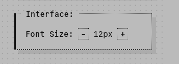
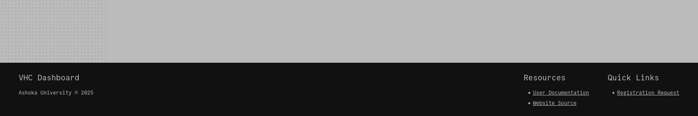
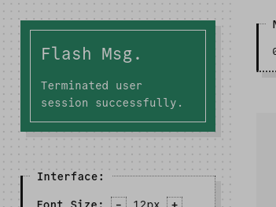
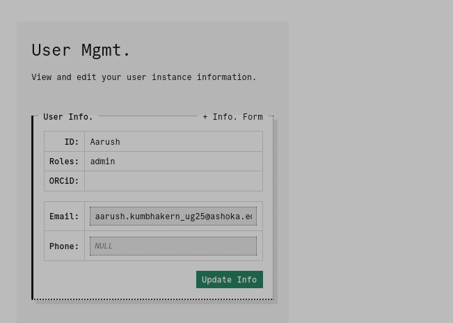

# User Documentation

Welcome to the VHC. This guide will walk you through the dashboard website and its various sub-applications.

## Contents

- [User Documentation](#user-documentation)
	- [Contents](#contents)
	- [General](#general)
		- [Interface Settings](#interface-settings)
		- [Navigation](#navigation)
		- [Footer](#footer)
		- [Flash Messages](#flash-messages)
	- [User Management and Auth.](#user-management-and-auth)
		- [Registration](#registration)
		- [Login](#login)
		- [Management](#management)

## General

### Interface Settings

The dashboard hijacks the browser's default zoom controls (`ctrl+=`, and `ctrl+-`) to provide a more pleasant zooming experience. Current zoom level and mouse controls for the same can be found in the sidebar. Global font scale is bounded between `12px` and `18px`.

### Navigation

The dashboard's primary navigation can be found at the top of the page. The main navigation links are accessible via keyboard shortcuts: `ctrl+[0-9]`.

### Footer

The footer at the bottom of the page serves as a constant repository of links to resources and important locations within the dashboard itself.

### Flash Messages

The dashboard will occasionally "flash" a transient message to relay information or confirm the success of an operation. The message will appear once, and will disappear as soon as the user navigates away from the page.

## User Management and Auth.

The dashboard uses an entirely local auth. system, with support for [administrative functions](#admin), and role-based access. As a new user, your first experience with auth. will be:

### Registration

Registration on the dashboard is processed in the form of a request, subject to approval by site administrators. To register, you must navigate to `/register`, accessible via. the link on either the login portal or the **Quick Links** section of the footer. 

A registrant is prompted for the following details (mandatory fields in bold):

- **Unique user ID**
- **Unique email ID**
- ORCiD
- Phone no.
- **Passkey**
- Comments (for the approving authority)

> [!NOTE]
> Once set, the ORCiD cannot be updated

You will be notified via flash message following a successful registration request submission.

### Login

Registered users may navigate to `/login` to begin an authenticated session. Users who have submitted a registration request but have not yet been approved will not be allowed to log in, and will be notified as such.

### Management

Registered users may navigate to `/user` to view and manage their user instance. Users are allowed to edit their:

- Email ID
- ORCiD
- Phone no.

> [!NOTE]
> Once set, the ORCiD cannot be updated

